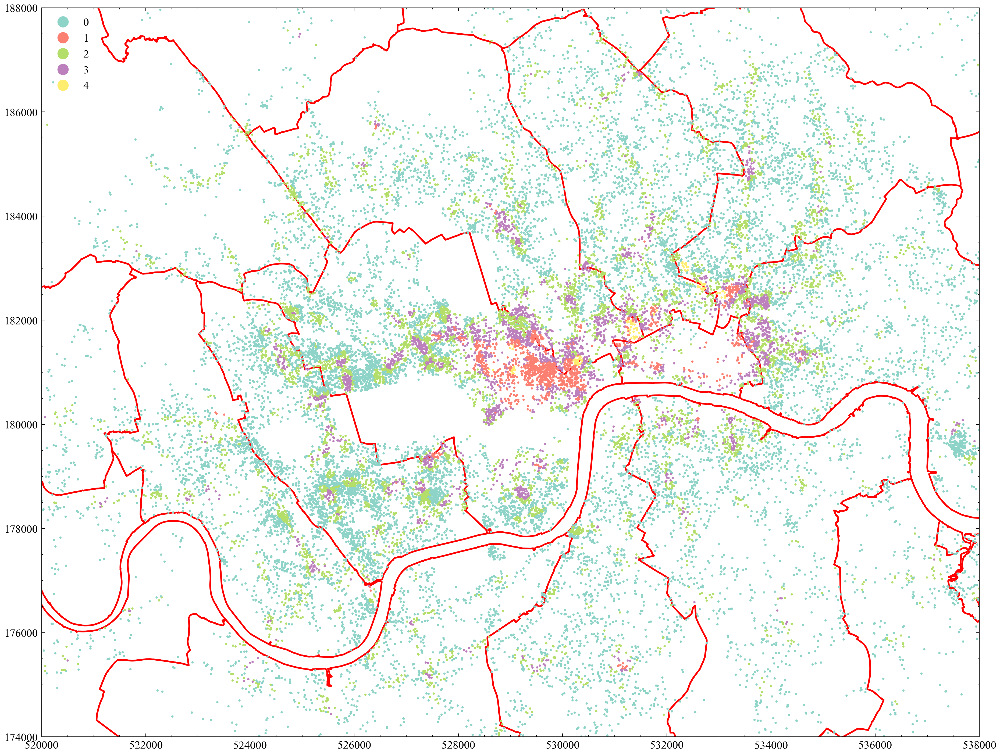

# i2p_cw

*   get sequence of POIs for each listing within a buffer distance =100  
*   Train sequences to get POIs vector 
*   POI vectors clustering and correlation with POI classes 
*   Sum up surroundings POIs to get listing vector
*   Listing vector clustering and correlation with price 

Result:

TODOs:

*   Parameters 
*   Reorder/shuffle
*   Skip_gram/ cbow
*   Buffer distance
*   Clustering methods
*   Explore POI vectors 
    *   [word2vec](http://nbviewer.ipython.org/urls/raw.github.com/danielfrg/word2vec/master/examples/word2vec.ipynb)
    *   Similarity
    *   Phrases
    *   Analogies